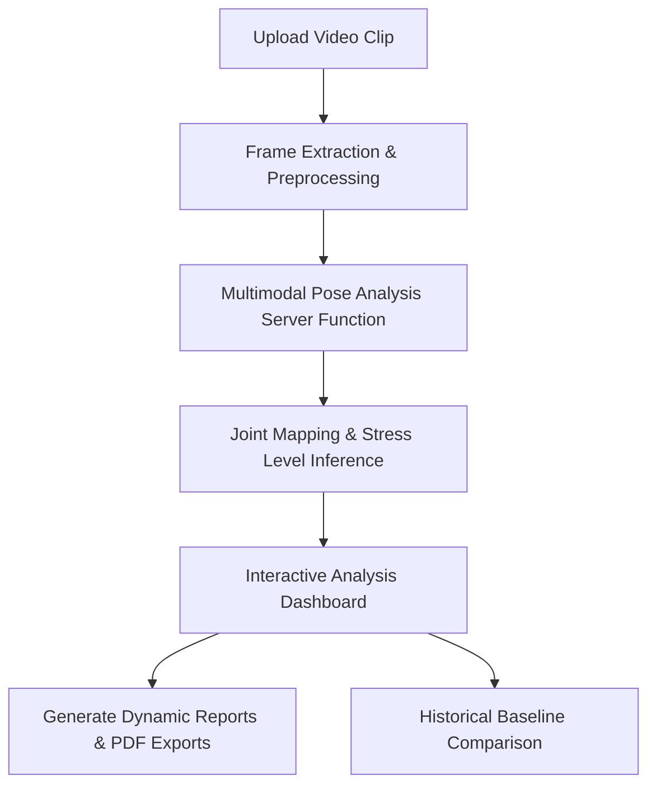

# Milestone 1: Project Initialization, Design Process & Core Setup

This document provides a comprehensive overview of the architectural design, database schema, authentication system, and biomechanics workflows implemented for **KinetIQ** (Sport Sentinel) in Milestone 1.

---

## 📋 Table of Contents
1. [Project Objectives & Injury Detection Workflows](#1-project-objectives--injury-detection-workflows)
2. [System Architecture](#2-system-architecture)
3. [Database Schema & Roles](#3-database-schema--roles)
4. [Authentication & Profile Management](#4-authentication--profile-management)
5. [Biomechanics Datasets Reference](#5-biomechanics-datasets-reference)
6. [File Map & Reference Links](#6-file-map--reference-links)

---

## 1. Project Objectives & Injury Detection Workflows

KinetIQ is designed as an AI-powered sports biomechanics and injury risk detection platform. It enables athletes and coaches to analyze movement patterns from video clips, estimate joint coordinates, track posture scores, and predict potential injuries.

### 🔄 Injury Detection Workflow

1. **Video Upload & Frame Extraction**: The athlete/coach uploads an MP4/MOV video. Frames are extracted locally at varying granularities (6, 10, or 16 frames) depending on the desired speed vs. depth of analysis.
2. **AI Pose Inference**: Extracted frames are sent to the backend `analyzePose` server function, which leverages vision models to detect sport type, track body joint positions, and evaluate overall mechanical alignment.
3. **Injury Risk Report**: The frontend renders a comprehensive suite of charts (e.g., radar charts for landing technique, joint stability, balance, fatigue) and flags specific risky frames alongside targeting corrective exercises.

---

## 2. System Architecture

KinetIQ is built using a modern full-stack web architecture prioritizing performance and low latency.

* **Frontend Framework**: [Vite](https://vite.dev) with [TanStack Start](https://tanstack.com/router/latest/docs/start/overview) (allowing hybrid SSR and Server Functions).
* **Routing**: Typesafe file-based routing via [TanStack Router](https://tanstack.com/router).
* **Database & Auth**: [Supabase](https://supabase.com) (PostgreSQL) for user authentication, profile data, and role-based policies.
* **Styling & UI**: Tailwind CSS coupled with shadcn/ui components, Lucide icons, and Recharts for interactive analytics.

---

## 3. Database Schema & Roles

The PostgreSQL schema is managed via Supabase migrations. It handles users, authentication roles, and individual physical profiles.

### 👥 Role-Based Access Control (RBAC)
We support three distinct roles:
1. **Athlete**: Can view/update their own profile and run pose analysis.
2. **Coach**: Can view all profiles and analysis reports for performance tracking.
3. **Admin**: Platform administration.

### 🗄️ Table Definitions & Schema
The database migrations establish the following main tables:

#### `public.user_roles`
Tracks roles assigned to authenticated users.
* `id` (UUID, Primary Key)
* `user_id` (UUID, Foreign Key -> `auth.users`)
* `role` (app_role enum: `'athlete'`, `'coach'`, `'admin'`)
* `created_at` (TIMESTAMPTZ)

#### `public.profiles`
Stores physical and sporting metrics for athletes.
* `id` (UUID, Primary Key -> `auth.users`)
* `full_name`, `display_name` (Text)
* `date_of_birth` (Date)
* `gender`, `dominant_side` (Text)
* `height_cm`, `weight_kg` (Numeric)
* `primary_sport`, `position` (Text)
* `experience_years` (Integer)
* `training_frequency`, `injury_history`, `goals` (Text)
* `avatar_url` (Text)
* `created_at`, `updated_at` (TIMESTAMPTZ)

---

## 4. Authentication & Profile Management

* **User Authentication**: Handled securely via Supabase Auth. It supports traditional Email/Password signup and Sign-in, alongside Google OAuth integration.
* **Automatic Provisioning**: PostgreSQL triggers (`on_auth_user_created` trigger executing `handle_new_user()`) automatically create an empty athlete profile and assign the default `'athlete'` role on signup.
* **Profile Customization**: Users can edit their biometric data and training goals, which are stored in the `profiles` table to provide contextual analysis parameters (e.g., assessing load tolerance based on weight).

---

## 5. Biomechanics Datasets Reference

The underlying models and research are designed around standard sports science and pose tracking datasets:

| Dataset | Primary Focus | Application in KinetIQ |
| :--- | :--- | :--- |
| **Human3.6M** | 3D human pose estimation, joint tracking | Formulating coordinate mappings & anatomical calculations |
| **Sports Injury Risk Detection (Video)** | Video action recognition, injury labeling | Tracking fatigue markers & high-speed landing deviations |
| **MPII Human Pose Dataset** | Body keypoint detection, activities | Broad-scale activity recognition & keypoint normalization |
| **COCO Keypoints** | 17 standard body keypoints | Training coordinates for general posture extraction |
| **SportsPose** | Sports-specific motion analysis | Sports performance assessment & sport-specific tracking |
| **FIFA Injury Dataset** | Trend modeling, risk factor analysis | Contextual reference for modeling specific joint stress risk profiles |

---

## 6. File Map & Reference Links

Below are links to the main implementation files in the repository:

* **Authentication UI**: [auth.tsx](file:///Users/ishanibassin/Projects/INFOSYS/sport-sentinel/src/routes/auth.tsx) - Core email/password & OAuth flows.
* **Profile Management Page**: [profile.tsx](file:///Users/ishanibassin/Projects/INFOSYS/sport-sentinel/src/routes/_authenticated/profile.tsx) - Form workflows to manage athletic stats.
* **AI Analysis Server Engine**: [analyze.functions.ts](file:///Users/ishanibassin/Projects/INFOSYS/sport-sentinel/src/lib/analyze.functions.ts) - Schema definitions and server-side pose extraction.
* **Main Application Dashboard**: [index.tsx](file:///Users/ishanibassin/Projects/INFOSYS/sport-sentinel/src/routes/index.tsx) - Video analysis components, joint heatmaps, dynamic charts, and PDF generator.
* **Supabase Database Schema**: [20260709103832_6e8fe6ce-dc3a-46b1-87c3-ba28c0d2d992.sql](file:///Users/ishanibassin/Projects/INFOSYS/sport-sentinel/supabase/migrations/20260709103832_6e8fe6ce-dc3a-46b1-87c3-ba28c0d2d992.sql) - Database table structures and RLS security policies.
